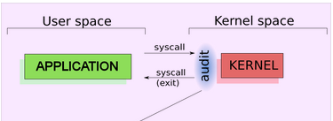

:doctype: book
:stylesheet: ../../cctc.css

= Activity - AUDITDFiles
:doctype: book
:source-highlighter: coderay
:listing-caption: Listing
// Uncomment next line to set page size (default is Letter)
//:pdf-page-size: A4

== Learning Objectives

* CCNI009       - Identify auditing activities
** CCNI009.001   - Explain system logging
** CCNI009.002   - Identify application logging
** CCNI009.003   - Explain authentication and authorization logs
* CCNI010       - Identify actions that contribute to log files
** CCNI010.001   - Describe the actions that contribute to entries in log files
** CCNI010.002   - Analyze log files for anomalous activity

{empty} +

== Learning Outcomes

[square]
* Familiarity with auditd tool set, and it's functionality
* Understand inode table structure & functionality

{empty} +

== Activity

=== Task 1)

* Create a script that audits the `/etc/passwd` and `/etc/group` files.
** Make sure your script triggers on any read, write, execute, or attribute changes.
** Have your script output the new audit rules your script sets.  
** Keep in mind that the audit process you establish will be tested by whether or not it captures the traffic you input as you manipulate files on your VM.
* Have your script:
** add a new group named `cctc_audit`
** create a new user called `cctc_auser`
** add user `cctc_auser` to group `cctc_audit`
** set a password for `cctc_auser`.

=== Task 2)
* Regain access to the audits you set up earlier in the exercise and review what traffic they captured manually using color grep , and using `ausearch` tool.

{empty} +

== Deliverables

* Your script 

{empty} +

== Hints

* Do you need to login as a different user to generate the audit logs?
* `$ sudo apt-get install -y auditd multitail`

{empty} +

== Useful Resources

https://access.redhat.com/documentation/en-us/red_hat_enterprise_linux/6/html/security_guide/chap-system_auditing +
https://access.redhat.com/documentation/en-us/red_hat_enterprise_linux/6/html/security_guide/sec-defining_audit_rules_and_controls +
