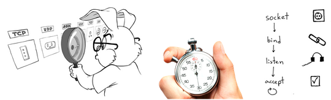

:doctype: book
:stylesheet: ../../cctc.css

= Exercise - BASHSOC
:doctype: book
:source-highlighter: coderay
:listing-caption: Listing
// Uncomment next line to set page size (default is Letter)
//:pdf-page-size: A4

== Scenario

You've been tasked to generate a non-netcat socket that allows you to connect to your SSH server.  In order to understand how the target might detect your activities, you need to fully understand how  /dev/tcp  operates, and what, if any, artifacts it generates on the target system. 

== Exercise

Write a bash script that uses Linux /dev/tcp  to allow you to connect to the SSH server on your localhost.  Utilize the exec command to open a file descriptor attached to the /dev/tcp socket.

Finally, find the directory where the newly-spawned file descriptor is located on your machine, and get the file descriptor's octal permissions value (file: pipe[random #s] )

Hint: how can you see a newly-spawned ssh service?

Pseudo Hint: https://youtu.be/Thojv5MviW8

== Submit
+70% - completely automated, functioning bash script. +
+10% - snapshot of scripts output. +
+10% - snapshot of any log artifacts, displaying command used. +
+10% - explanation for limited existence of `/dev/tcp` SSH socket. +

== Check Your work
----
$ echo <octal permissions value> | md5sum

62b5942b6aabb2aa53df28074c1b834f
----
== Learning Objectives / Outcomes

[square]
* Familiarity with `/dev/tcp` sockets capabilities & their varying functionality with diferent protocols
* Knowledge of the artifacts generated by the formed socket
* Process generation & completion within scripts

== Usefull Resources

https://www.lanmaster53.com/2011/05/7-linux-shells-using-built-in-tools/