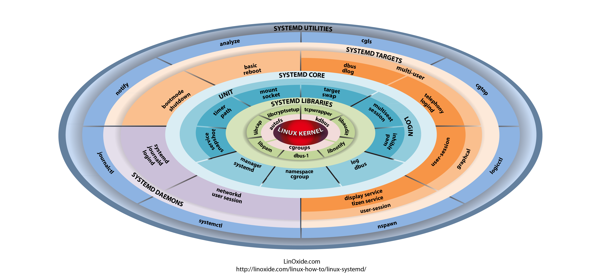

:doctype: book
:stylesheet: ../../cctc.css

= Activity - JOURLOG
:doctype: book
:source-highlighter: coderay
:listing-caption: Listing
// Uncomment next line to set page size (default is Letter)
//:pdf-page-size: A4

== Learning Objectives

* CCNI009 - Identify auditing activities
* CCNI009.001 - Explain system logging
* CCNI009.002 - Identify application logging
* CCNI010 - Identify actions that contribute to log files
* CCNI010.001 Describe the actions that contribute to entries in log files
* CCNI010.002 Analyze log files for anomalous activity

{empty} +

== Outcomes

[square]
* Understanding capabilities of SYSTEMD journalctl tool
* Deployment of journalctl in a Linux infrastructure

{empty} +

== Activity

Requirements: linux system with SYSTEMD installed

=== Task 1)

Write a script that utilizes journalctl to evaluate the kernel’s error and warning messages twice on your system, at 30 sec intervals, uses `diff` to compare the two output files, and output the results to a file located in `/usr/share/cctc/`.  

=== Task 2)

Utilize journalctl to display the last 10 logs entries associated with the cron service, ever generated, and the last 15 log entries associated with your UID that generated in the last hour, and output all the results one file located in `/usr/share/cctc/` in addition to displaying the results to screen.

{empty} +

== Deliverables

* A file containing all of the results

{empty} +

== Hints

* `tee --help`

{empty} +

== Useful Resources

https://www.loggly.com/ultimate-guide/using-journalctl/
