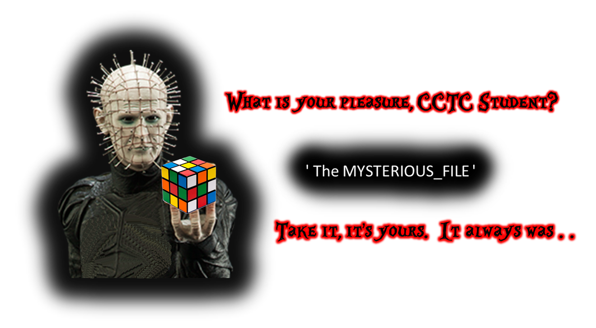

:doctype: book
:stylesheet: ../../cctc.css

= Activity - LEMARCHAND
:doctype: book
:source-highlighter: coderay
:listing-caption: Listing
// Uncomment next line to set page size (default is Letter)
//:pdf-page-size: A4

== Learning Objectives

* CCNI002       - Employ commands using common shells
** CCNI002.003   - Demonstrate appropriate use of pipes and redirection
** CCNI002.004   - Explain the fundamentals of Boolean logic
* CCNI007       - Develop shell scripts
** CCNI007.001   - Demonstrate basic familiarity with shell scripting
** CCNI007.002   - Explain variables and variable manipulation
** CCNI007.003   - Employ commands for string manipulation

{empty} +

== Learning Outcomes

[square]
* Familiarity with BASH conditionals
* Conditionals with magic numbers and file types

{empty} +

== Activity

[square]
Write a script that iteratively un-compresses the file type, until you reach the final file, the FLAG within.
* Compressed file location: /usr/share/cctc/MYSTERIOUS_FILE

{empty} +

== Deliverables

* Your script 

{empty} +

== Hints

* while, for, if, elif, file

{empty} +

== Useful Resources

http://tldp.org/LDP/Bash-Beginners-Guide/html/chap_07.html +
http://tldp.org/LDP/Bash-Beginners-Guide/html/sect_07_01.html +