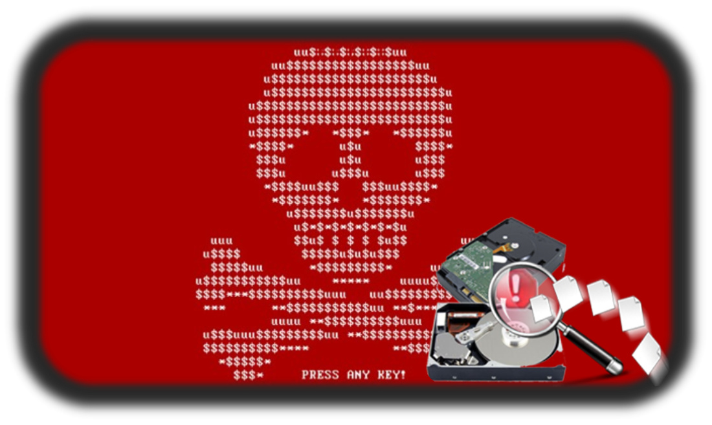

:doctype: book
:stylesheet: ../../cctc.css

= Activity - MBRoken
:doctype: book
:source-highlighter: coderay
:listing-caption: Listing
// Uncomment next line to set page size (default is Letter)
//:pdf-page-size: A4

== Learning Objectives

* CCNI004 - Describe the Linux boot process
** CCNI004.001 - Identify components of the boot process
** CCNI004.004 - Describe partitions

{empty} +

== Learning Outcomes

[square]
* Familiarity with the parts of a correctly formatted Linux MBR
* Ability to analyze an MBR using CLI binaries and identify misconfigurations.

{empty} +

== Scenario

The hard drive in your Commander's laptop, containing critical files, stopped responding after a network-wide malware attack. You're fairly certain the problem has something to do with the HD's MBR (file: "mbroken").

{empty} +

== Activity

[square]
* You have access to a baseline MBR (mbrgood.zip), as well as the bad MBR (mbroken.zip)
** The files are located here: `/usr/share/cctc/`
* Start by verifying that you have the correct boot record file. 
** Unzip the file `mbroken.zip` and check its MD5 hash: `b73f30cf162511fe8429ff907a5a9f53`

* Using Linux binaries:
** MD5 hash the bootstrap/bootloader code.
** MD5 hash the second partition entry code.
** Figure out what's still wrong with the MBR. Find the hex characters (ALL CAPS, no spaces).
*** NOTE: You are looking for a string of hex characters (i.e. "DEADBEEF").

{empty} +

== Deliverables

Check your work:  `$ CMD... | md5sum`

* Bootstrap code:   `d59a68c7b6d62ecaa1376dfb73a3b7be`
* Second partition: `41a8cbc4d7314c23c7e7f6b0a799d76b`
* Hex string:       `d7c07574567e1af6856be94a590ec2dc`

{empty} +

== Hints

* `dd`, `hexdump`
* Read up on the specs for a properly formated MBR
* Your endian may be off

{empty} +

== Useful Resources

http://thestarman.pcministry.com/asm/mbr/PartTables.htm +
Operational Context: http://www.pcworld.com/article/3046626/security/petya-ransomware-overwrites-mbrs-locking-users-out-of-their-computers.html +
