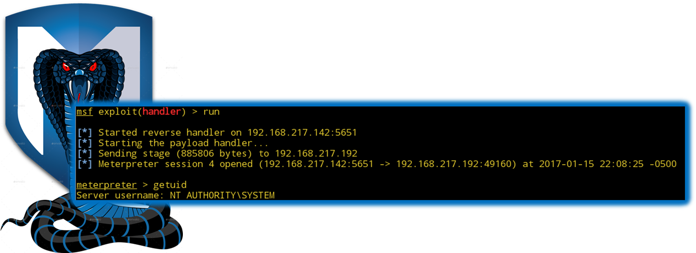
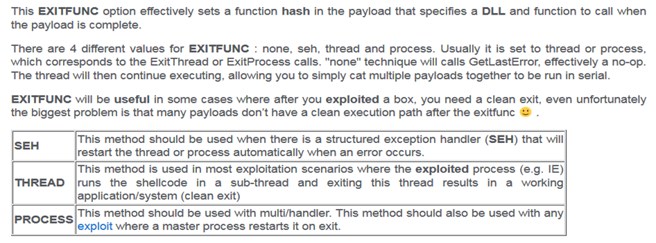

:doctype: book
:stylesheet: ../../cctc.css

= Activity - MSFVenom
:doctype: book
:source-highlighter: coderay
:listing-caption: Listing
// Uncomment next line to set page size (default is Letter)
//:pdf-page-size: A4

{empty} +

== Learning Objectives

* CCNI013       - Explore Linux Exploitation tools
** CCNI013.001   - Discuss shell code
** CCNI002.002   - Identify remote shell code execution
** CCNI002.005   - Identify purposes for Metasploit
** CCNI013.007   - Identify the purposes for custom malware

{empty} +

== Learning Outcomes

[square]
* Familiarity with msfvenom
* Ability to design specific shellcode to match intended target specifics

{empty} +

== Activity

[square]
* Using msfvenom, generate two custom payloads, 1 for a Window XP system, and 1 for a Windows 7 system. 
** The Windows XP payload needs to callback to the attacking machine and re-connect at reboot.
** The Windows 7 payload needs to callback to the attacking machine only when triggered by a user (get creative: replace IExplore icon, utilman.exe, etc.).
*** Be sure your exploits are gaining SYSTEM level access.

{empty} +

== Deliverables

* SYSTEM shell on target systems

{empty} +

== Hints

* Bad Shellcode Characters:
** 0x00 == NULL Byte:  NULL Bytes cause a STRCPY oper to terminate, which can truncate our buffer and ignore our shellcode.
** 0x0D == Carriage Return: would signify end of PASSWORD field, and terminate the buffer at that point.
** 0x0A == Line Feed: same reason as the carriage return.
** 0x20 == Spaces

*** Syntax: `-b "\x00\x0a\x0d\x20"`

{empty} +

{empty} +

== Useful Resources

https://github.com/rapid7/metasploit-framework/wiki/How-to-use-msfvenom +