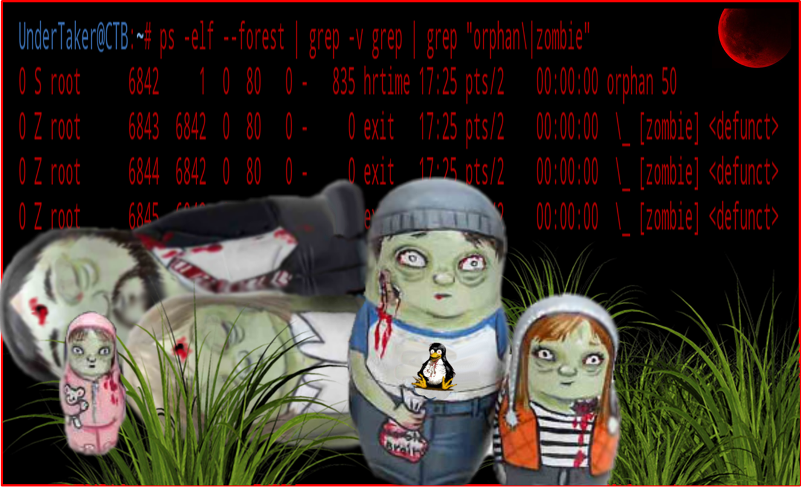

:doctype: book
:stylesheet: ../../cctc.css

= Activity - Orphaned Zombies

== Learning Objectives

* CCNI006       - Identify Linux processes
** CCNI006.003   - Employ commands to enumerate processes
** CCNI006.005   - Discuss orphaned and defunct processes
** CCNI006.007   - Evaluate the validity of Linux processes
* CCNI007   - Develop shell scripts
** CCNI007.001   - Demonstrate basic familiarity with shell scripting
** CCNI007.002   - Explain variables and variable manipulation
** CCNI007.003   - Employ commands for string manipulation

== Learning Outcomes

* Familiarity with linux processes and process management
* Familiarity with ps binary
* Confidence spawning and manipulating processes 

== Scenario

* You need to create some abnormal process behavior on a target system to consume resources and alert admins of "suspicious" activity.

=== Task 1)

* Three Orphaned Zombies:
** Write a script that creates three zombie / defunct processes that are orphaned.
** Your orphaned zombies should only exist temporarily for 30 seconds and should automatically resove themselves after that time period.
** Ensure the defunct process are orphaned and adopted by init.
** Identify the orphaned zombies in a process list output.
* What is the danger of having many zombie processes running at one time?

== Deliverables

* Your script that creates the three orphanded zombies

== Hints

* Zombie: `sleep 1 & exec sleep 60`
* Orphan: `(sleep 60 &)`

----
if [ $(ps -AL --no-headers | wc -l) -ge $(( $(cat /proc/sys/kernel/pid_max) - 100 )) ]
then
    echo 'ZOMBIE ATTACK!'
else
    echo "all good"
fi
----

== Challenge

* N/A

== Useful Resources

* https://www.gmarik.info/blog/2012/orphan-vs-zombie-vs-daemon-processes/
