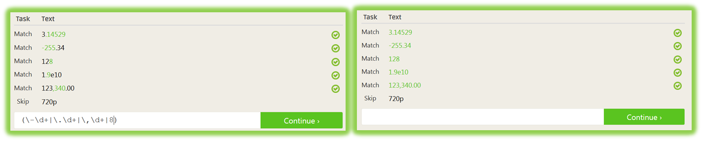

:doctype: book
:stylesheet: ../../cctc.css

= Activity - Regular Expressions 1
:doctype: book
:source-highlighter: coderay
:listing-caption: Listing
// Uncomment next line to set page size (default is Letter)
//:pdf-page-size: A4

{empty} +

== Learning Objectives / Outcomes

* CCNI003 -  Analyze the Linux file system
** CCNI003.007 - Describe regular expressions
** CCNI003.008 - Create regular expressions to find data within in the file system
** CCNI003.009 - Identify the information that a regular expression will return

{empty} +

== Learning Outcomes

[square]
* Familiarity with regular expressions, their syntax and application
* Confidence generating simple regular expressions to match specific patterns

{empty} +

== Activity

Access RegexOne REGEX interactive tutorial at the following location: https://regexone.com/

[square]
* Complete REGEX Lessons 1-15
* Complete REGEX Problems 1-8
* Identify a complete solution to all problems
** While the solution on the LEFT will allow you to continue, it is not a complete solution, like the one on the RIGHT.

{empty} +

== Deliverables

* List of regular expressions used to solve each lesson and problem

{empty} +

== Challenge

Lesson X and Problem X

{empty} +

== Useful Resources

https://regexr.com/ +
