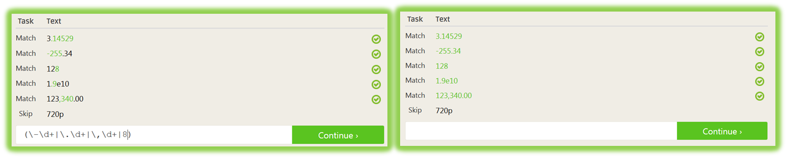

:doctype: book
:stylesheet: ../../cctc.css

= Activity - Regular Expressions 1
:doctype: book
:source-highlighter: coderay
:listing-caption: Listing
// Uncomment next line to set page size (default is Letter)
//:pdf-page-size: A4

== Setup

Access RegexOne REGEX interactive tutorial at the following location: https://regexone.com/

== Activity

[square]
* Complete REGEX Lessons 1-15
* Complete REGEX Problems 1-8
* Lesson X and Problem X are optional
* Identify a complete solution to all problems; While the solution on the LEFT will allow you to continue, it is not a complete solution, like the one on the RIGHT.

== Deliverables

[square]
* List of regular expressions used to solve each lesson and problem

== Learning Objectives / Outcomes

[square]
* Familiarity with regular expressions, their syntax and their application
* Confidence generating simple regular expressions to match specific patterns
