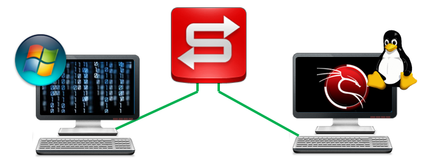

:doctype: book
:stylesheet: ../../cctc.css

= Activity - SAMBA

== Learning Objectives

* CCNI008 - Identify Linux networking features
** CCNI008.006  - Describe the advantages and disadvantages of Samba 

== Learning Outcomes

* understand how to employ SAMBA services to transport files between unlike systems.

== Scenario

* You are operating on a system that your team has previously gained access to.  Using only the SAMBA protocol, you need to exfil the SYSTEMINFO off the target Windows system.

=== Task 1)

* Write a bash script that achieves the following objectives:
** creates a shared directory named `/cctcsmb`  with read, write, and execute permissions for Owner, Group and Others
** adds a new Samba user named `samcctc`
** creates a group called `smbusers`
** adds `samcctc` to this new group
** gives `samcctc` ownership of the `/cctcsmb` directory
** configure `smb.conf`  file so that it allows guest access, is not read only, and can also be browsed

* have your script output:
** the settings of ONLY the permissions settings for the files and/or groups, directories you altered. 

=== Task 2)
 
* non-scripted:
** Connect to the SAMBA Server you setup via a Windows system using user `samcctc`
** exfiltrate the SYSTEMINFO, via SAMBA, from the Windows target

== Deliverables

* Your script
* SYSTEMINFO from target Windows system

== Hints

* `systemctl restart smbd`
* `systemctl restart smb.service`

== Useful Resources

* http://www.tldp.org/HOWTO/SMB-HOWTO-7.html
* https://www.brennan.id.au/18-Samba.html
