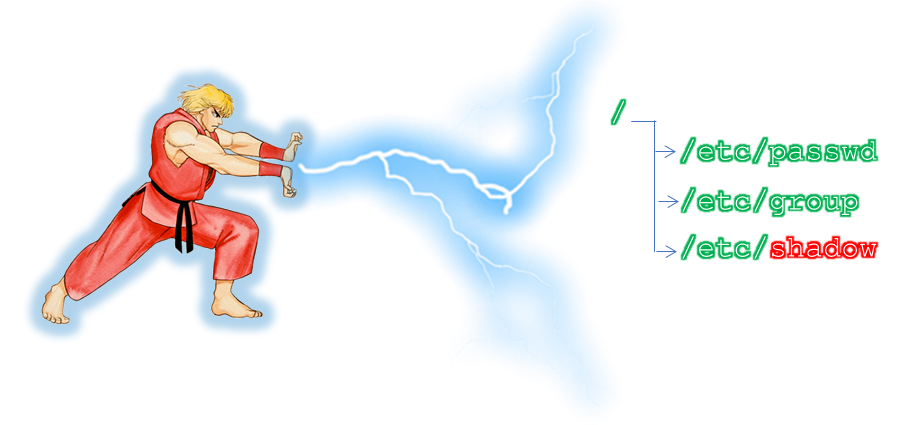

:doctype: book
:stylesheet: ../../cctc.css

= Activity - SHADOWken
:doctype: book
:source-highlighter: coderay
:listing-caption: Listing
// Uncomment next line to set page size (default is Letter)
//:pdf-page-size: A4

== Learning Objectives

* CCNI003 - Analyze the Linux file system
** CCNI003.002 - Describe file system ownership properties
** CCNI003.003 - Discuss file system permissions

{empty} +

== Learning Outcomes

[square]
* Familiarity with key Linux files: `/etc/{passwd,group,shadow}`
* Familiarity with Linux command line text-editors
* Understand group membership and its effects on file access
* Confidence querying and editing password attributes for groups and users

{empty} +

== Scenario

You have gained limited privileged access to a system whose authentication security protocol was easily bypassed.

{empty} +

== Activity

=== Task 1)

[square]
* Escalate your priveleges and display the system's shadowed user passwords
** Copy your `/etc/{passwd,group,shadow}` files to a backup directory.
** As a user in the sudoers group, add a user 'ken' to the system
** Using a text-editor, edit user 'ken' in `/etc/{passwd,shadow}` for the following:
*** Group ID 0
*** BASH shell
*** home directory of `/home/ken`
*** password attribute to 'not required'
*** full name of `Maintenance Account`
*** account expiration of 1 Jan 2020
*** next password change for 30 days from now
*** password change warning of 10 days
* Check to ensure that your changes have taken effect via the command line

=== Task 2)

[square]
* Switch to the new user 'ken'
* Type `id`
* Are you in the root GID?
* Still as user 'ken', type `cat /etc/shadow`
* Why are you not able to view the shadow file?
** Hint: `ls -al /ect/shadow`
* Identify which groups user 'ken' belongs to; is user 'ken' in more than one group?
* How many groups are YOU in?

=== Task 3)

[square]
* Type `exit` to switch back to your sudoer user account
* Using a text editor, add user 'ken' to the group with write access to the `/etc/shadow` file
* switch back to user 'ken'
* Type `cat /etc/shadow`
* Were you able to open the file this time?

{empty} +

== Deliverables

[square]
* Verification of ken’s ability to read `/etc/shadow`
* Correct contents of `/etc/shadow`

{empty} +

== Useful Resources

https://www.cyberciti.biz/faq/understanding-etcshadow-file/
