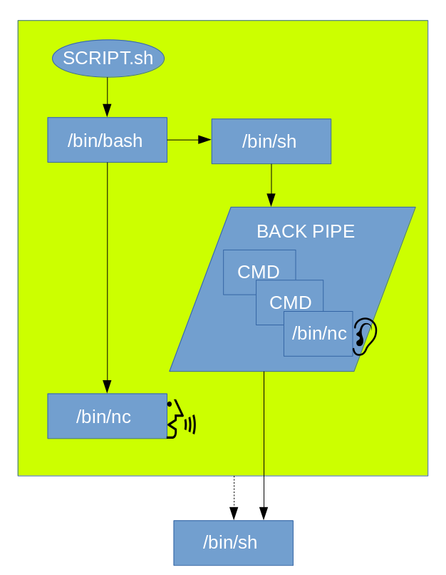

:doctype: book
:stylesheet: ../../cctc.css

= Activity - SimpleShell

== Learning Objectives

* CCNI002   - Employ commands using common shells
** CCNI002.003   - Demonstrate appropriate use of pipes and redirection
** CCNI002.004   - Explain the fundamentals of Boolean logic
** CCNI002.005   - Identify methods of gaining more information about commands and switches

== Learning Outcomes

* Familiarity with functionality of the netcat binary
* Greater understanding of fifos and backpipes, and what takes place with one

== Scenario

* N/A

=== Task 1)

* Create a bash script:
** host a BASH shell on a netcat listener.
* From the netcat listener:
** print out the host's machine-id: `$ cat /etc/machine-id  ||  cat /var/lib/dbus/machine-id`
* Do not install any binaries; use only the `/bin/nc` version already installed on the system

== Deliverables

* Your script 

== Hints

----
man /usr/bin/mkfifo | grep -A1 DESCRIPTION
man /bin/mknod | grep -A1 "DESCRIPTION\|FIFO"

mkfifo 123
ls -l | wc -l > 123 &
cat < 123
----

== Challenge

* N/A

== Useful Resources

* http://www.linuxjournal.com/article/2156
* https://www.lanmaster53.com/2011/05/7-linux-shells-using-built-in-tools/
