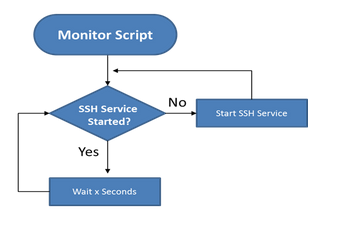

:doctype: book
:stylesheet: ../../cctc.css

= Activity - Triggered

== Learning Objectives

* CCNI006  - Identify Linux processes
** CCNI006.003  - Employ commands to enumerate processes
** CCNI006.004  - Explain the functionality of daemons

== Learning Outcomes

* Confidence using Linux scheduled tasks (cronjobs)
* Familiarity with Linux Daemon startup & functionality
* Familiarity with Bash conditional operations
* Confidence writing Bash scripts to achieve specific objectives

== Scenario

* A new denial of service, zero day, that remotely disables the SSH service, is being used against your publicly exposed server. 

=== Task 1)

* Write a script that monitor the state of the SSH service:
** have your script:
*** monitor every minute to ensure that the SSH service is running
*** automatically re-enable the SSH service if it's disabled
*** the SSH service should never be down for more than one minute
*** if the service is enabled, the script wait "x" seconds and check the service status again

=== Task 2)

* For additional functionality:
** orphan the monitoring process so that, once launched, the script continues to run if you close the terminal

=== Task 3)

* Test your script on your system to ensure it is properly running:
** launch the monitoring script
** disable the SSH service
** verify that the script automatically re-enables the service

== Deliverables

* The script that monitors for the SSH service and relaunches the service as necessary

== Useful Resources

* https://crontab.guru/
* https://bscb.cornell.edu/about/resources/linux-cron-and-crontab
