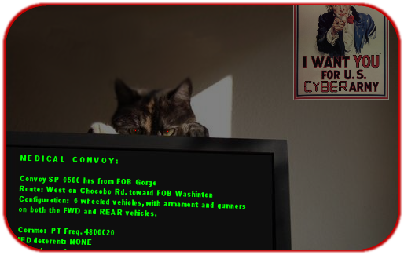

:doctype: book
:styledir: /home/gitlab-runner/builds/119e33fe/0/CCTC/public/
:stylesheet: {styledir}cctc.css
//file path above may change depending on the location

= Exercise – Disorderly Domain

== Learning Objectives 

* CCWI028: Identify Active Directory basics
** CCWI028.001: Identify the Active Directory Schema and Global Catalog
** CCWI028.002: Describe the features of Active Directory
** CCWI028.003: Explain the logical and physical structure of Active Directory
** CCWI028.004: Describe functions of the resources associated with Active Directory
** CCWI028.005: Employ command line tools to gain information about a system or network

== Outcomes

[square]
* Familiarity with Domain Controller Objects
* Familiarity with the Domain Services Command Line Tools
* Familiarity of DoD cyber security best practices pertaining to accounts, groups, and computers
* Understanding the capabilities of Remote Server Admin Tools

== Setup

[square]
* Add new stack template: +
`10.50.22.211/heat/DD.yaml`
* Download and install Remote Server Administration Tools (RSAT) on your WIN10 system: +
once logged in to Win10, there will be a desktop shortcut for Win10 RSAT download. 

== Scenario

You are responding to an incident concerning anomalous activity with a DC (Domain Controller). +
Arriving on scene, the S-6 has explained that many users have reported anomalous activities concerning the attributes of their accounts. +
The Brigade's mission is to diminish the efforts of a terrorist organization, known as E.V.I.L. +
The Brigade Commander is convinced that someone in his organization is working with E.V.I.L., and is very concerned that the details concerning an operation for an +
Emergency Convoy of Critical Medical Supplies may have been leaked by unknown trusted insider(s). +
He wants you to determine if the operation details have been leaked, without tipping off the unknown trusted insider(s). +
For this reason, you are not to delete, disable, or otherwise alter any active directory object, in any way. +

== Activity

Using PowerShell and the Domain Services skills you have learned, achieve the following objectives (be sure to include all findings in your report):

[square]
* Find and report security violations concerning shared files and folders in the "Warrior Share" drive.
* Verify Account Security requirements IAW S-6 Password Security SOP (location: Windows 10 Desktop) are being met.
* Locate and report any account anomalies.
* Report any additional anomalous findings to the Brigade S-2 (Instructor) to determine if they warrant further investigation.
* Determine if details of the Medical Convoy have been leaked or not.
* While you may peruse the GPO all you like, it is out of scope.

*Credentials:*

*Domain Controller:* +

  user:     Administrator
  password: PassWord12345!!

*Windows 10 (Remote Connection):* +

  user:     administrator
  password: password

*Note:* Do not make any changes to the DC. Do not write files. Do not delete files. Only use *_query_* and *_get_* style commands. +
Do not use any variation of an *_add_* command or *_mod_* command.

== Hints: 

  net use * \\10.<student ID>.0.1\"Warrior Share" /user:army.warriors\Administrator PassWord12345!!
  dsquery user -name * -limit 0 -s 10.<student ID>.0.1 -u Administrator -p PassWord12345!! | dsget user -samid -tel -dn -s -10.<student ID>.0.1 u Administrator -p PassWord12345!!
  
  # credentials are not persistent through a pipe; must be provided again after a pipe in command line.

== Challenge:
NONE

== Deliverables

A detailed report of the active directory objects security posture and shortfalls, as well as any security posturing recommendations to staff sections.

== Useful Resources
https://ss64.com/nt/dsget.html +
https://ss64.com/nt/dsquery.html +
https://ss64.com/ps/ad.html +